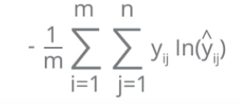

# **INTRODUCTION TO NEURAL NETWORKS**

## **PERCEPTRONS**
Neural networks are formed by a bunch of "cells or units" connected to each other, sending and classifying information. These units are what we call perceptrons and they look like this: 

In the image above shows a perceptron that takes _x_n_ values values as inputs, and spits out an output. Having said that, we can then think of a perceptron as a function, that takes some parameters and gives us an output. For example:

*x_1 + x_2 + x_3 + b = 0*

If we represent it it could look something like this (This is not a real representation of the example):

What that function is saying is that when we pass any values, if the result if below 0, the point is going to be represented under the line, and if the result is over 0 it will be represented over the line. Therefore with this perceptron we already have a function that can classify our inputs. If we wanted to predict who is going to get accepted to university based the marks of a final exam as one input, and the average marks of high school as the other input, this function could give us a prediction of who is going to get accepted and who isn't.

Obviously we can't start with a function that already knows how to predict something, we need to train it first. We'll get to that in a bit.

## **WEIGHTS AND BIAS**

As I said above, a perceptron is nothing but a function that takes in some inputs, and spits out some outputs. This function also takes two other parameters as variables, the weights and the bias. Taking the example from before, the function would look like this:

*W_1.x_1 + W_2.x_2 + W_3.x_3 + b = 0*

Which we can summarize like this:

*W.x + b = 0*

Where *W* are the weights, *x* the inputs, and *b* the bias. 

The weights and the bias are just the parameters that we will be adjusting during our training process to get our function to make better predictions. Think in the representation of the function above where we are trying to find the best line to separate the blue points from the red points. If the line is too high, a lot of red points will be misclasified and the same with the blue points if the line is too low. During the training of our model we can adjust these parameters to make our model better.

The bias *b* is just another parameter like the weights to help us adjust the function during the training process.

## **ACTIVATION FUNCTION**

An activation function is simply a function that takes in a number, and converts it into a value in a range, usually between 1 and 0.

Why do we need this? the answer is simple. Our model (function) is not simply going to tell us "red" or "blue", it is going to give us an answer as any number. And this number could be either positive or negative.

For the previous example with our red and blue dots, we can simply say: if we get any positive value it will be 1 ("blue"), and if we get any negative value, it will be 0 ("red"). This is called a threshold and it can be represented like this:

This is very cool and it makes things a lot simpler... but wait, what if we wanted to predict something that had more than two results? For example what if we gave our model an image of an animal and we wanted to konw if it is a cat, a dog or a bunny? Lets walk through it.

Imagine our model taking an input a few variables, size, cuteness, and furryness. And from these inputs it will make a prediction. For this example just imagine our output will be three different classes: cat, dog or bunny. Each class will give us a different number, telling us how likely it is that our prediction is a cat, dog or bunny.

For example our prediction could look like this:
* Dog: 32
* Bunny: 10
* Cat: 2

These numbers don't mean much to us, except we know that it is more likely that the prediction is a dog, than a bunny or a cat. We could convert these values between 1 and 0 simply by doing this: Dog/(Dog + Bunny + Cat). This will give us an average for each value between 0 an 1, which is great. In this case it would look like this:

* Dog: 0.72
* Bunny: 0.22
* Cat: 0.04

Now we can tell that our model predicted that it 72% likely that it was a dog, and 22% that it was a bunny etc. However as I mentioned before our model could very much give us negative values. Imagine we got these results instead:

* Dog: 10
* Bunny: 5
* Cat: -15

If we tried to do the same thing as before, we would get something divided by cero (10 + 5 + (-15) = 0), which wouldn't work out for us. A way to get around this is to use the exponential on every value, because this would turn them all into positive values:

This function is called softmax and is the exact same thing as before, but we do the exponential for every value. The result is going to be values between 1 and 0, and the sum of all of our classes (Dog, Bunny, Cat) will add up to one.

If we switch back to our first example, with all that we have learned our perceptron now looks like this:

## **ONE HOT ENCODING**

Before we jump into training our model by reducing the error function, lets briefly explain one hot encoding. 

Our model is a function, and it will only understand numbers, but our data can be other thins, like a string. What we can do in this case is convert all of our classes (Cat, Dog, Bunny for example) into one hot encoded values that are unique. The way we do this is by converting each value into a vector that has the same length as classes we  have (3 in this example) and we populate them with all ceros and a one, making sure each is unique. For example it could look like this:
* Dog: [1,0,0]
* Bunny: [0,1,0]
* Cat: [0,0,1]

## **MAXIMUM LIKELIHOOD AND CROSS ENTROPY**

Before I have explained how our model can take an input and give us a prediction. However we want to know how good our model is, is it giving us the right predictions, or is it complete rubish?

One way to know if our model is good is to compare the prediction with the value we expected. For example, if we gave our model an image of a dog, we would expect that the prediction would be dog. For example, imagine our prediction after applying softmax looks like this.
* Probabities of being a Dog: 0.7
* Probabities of being a Bunny: 0.2
* Probabities of being a Cat: 0.1

[0.7, 0.2, 0.1] looks very similar to our hot encoded values doesn't it? We can compare it to our one hot encoded vector of the value we expected and see if it looks similar. In our case our result resembles the one hot encoded value of dog, which is what we expect, where the probabilities of being a dog is almost one, and the other values are almost 0. We can think of the one hot encoded vector of the dog as the perfect prediction of a perfect model. In our case [1 (this one should be a dog, and should be as close to 1 as possible), 0 (this one shouln't be a dog, and should be as close to 0 as possible), 0 (this one shouln't be a dog, and should be as close to 0 as possible)].

Prediction 1 -> Good Prediction (table 1):

| Animal | Probabilities  | Expected (dog [1,0,0]) |
|--------| ------------- | ------------- |
|Dog| Probabities of being a Dog: 0.7  | 1 (this one should be a dog) |
|Bunny| Probabities of being a Bunny: 0.2  | 0 (this one shouldn't be a dog) |
|Cat| Probabities of being a Cat: 0.1  | 0 (this one shouldn't be a dog) |

Prediction 2 -> Bad Prediction (table 2):

| Animal | Probabilities  | Expected (bunny [0,1,0]) |
|--------| ------------- | ------------- |
|Dog| Probabities of being a Dog: 0.2  | 0 (this one shouldn't be a bunny) |
|Bunny| Probabities of being a Bunny: 0.2  | 1 (this one should be a bunny) |
|Cat| Probabities of being a Cat: 0.6  | 0 (this one shouldn't be a bunny) |

In this example our model is good (first table) because the prediction resembles the one hot encoded value of the animal we expect, the probability of the animal we expect is 0.7 which is the highest. The second table would be a bad model because the probability of the animal we expect (bunny) is 0.2.

That is what we call the maximum likelihood, which is taking the probability of the prediction that we expect to be 1. If we do this for all of our data we can compute the maximum likelihood and compare it to other models to see which one is better.

*Max likelihood = 0.7 x 0.2 = 0.14*

There is only one problem with this. The problem is that when we have a lot of data, we will have thousands of numbers for which we will compute the max likelihood, and therefore our result might be a very small number like 0.00000000000....03, which isn't very useful. Instead there is another way we can see if our model is good or not. With logarithms.

Logarithms have a nice identity that says that the *log(ab) = log(a) + log(b)*, therefore we could do the operation above like this *log(0.7) + log(0.2)*. Now we will get negative numbers, since the logarithm of any number between 1 and 0 is always a negative number. We can get around this by doing: *- log(0.7) - log(0.2))*, which will be a sum of positive numbers.

With this new way of doing things, the sum of the logarithms will give us a small value if the model is good (very accurate with predictions) and a big value if the model is bad (not very accurate). This is because the logarithm of a higher number is going to be closer to cero. Therefore, numbers with a bigger likelihood will be closer to 0. 

This is called the cross entropy. Cross entropy says the following: If I have a bunch of events and a bunch of probabilities, how likely is that those events happen based on the probabilities? If it is very likely we have a small cross entropy, and if it is unlikely we have a big cross entropy.

The formula is as follows: 

* _y_ is the expected value (1 or 0). This works because the values that aren't 1 won't be taken into sum. In other words, when comparing the probabilities we get in one prediction with the expected one hot encoded value (see table 1 or table 2 for reference), only the ones that equal to 1 will be taken into account.
* _p_ is the probability.
* _m_ is the number of classes (eg. Dog, bunny, cat). The sumation of _m_ would be applying this formula to all the probabilities for each prediction (eg. we want to predict if it is a cat) and adding them (as mentioned before this will equal 0 for the ones that equal the 0 in the hot encoded vector).
* _n_ is the number of predictions. This means adding the values of all the predictions we make.

## **ERROR FUNCTION**

#### LOGISTIC REGRESION

The logistic regresion logarithm basically goes like this:

* Take your data
* Pick a random model (random weights and bias)
* Calculate the error
* Minimize the error, and obtain a better model
* Enjoy!

#### ERROR FUNCTION

Our error function will basically be the same as the cross entropy. Which is the sum of applying the formula to all the classes (_n_) for all the predictions we make (_m_):

* _y_ is the label or expected output (1 or 0).
* _y_hat_ is the actual prediction. In the end _y_hat_ is our model function: *y_hat = softmax(Wx + b)*

Basically the lower our error function is, the better our model will perform, because it will clasify (predict) our classes better.

Imagine it could be represented like this:

Imagine it had two dimensions and we make some predictions. Once we compute the error function we find ourselves at the green point (below). We want to be at the lowest point, since that would be the smallest error, and therefore the best model. To find out how to move towards the lowest point we can calculate the negative of the gradient. The gradient is calculated by doing the sum of all the partial derivatives. This will give us the gradient of the fastest ascent, that is why we take the negative value to get the fastest descent. This way we can move towards the lowest point reaching the lowest error and the best model.

In reality the error function is a function of the weights (*w_1*, *w_2* ... *w_n*), where the error can be represented as the height. The logic is the same, we want to minimize the error therefore we compute the negative of the gradient descent to get the fastest descent. The gradient will be the vector sum of the partial derivatives of E with respect to *w_1*, *w_2* etc. It would look something like this:

* Where _y_hat_ is the prediction function.

Once we get our gradient, we want to take a step down the function to reduce the error. However we don't  want to make any dramatic changes that is why we multiply the gradient by a learning rate _alpha_ which could be any number below cero (usually 0.1, 0.01, 0.001 etc.). That way we will only be taking a small step.

The result of multiplying the gradient times the learning rate, will be substracted (remember we want the fastest descent not the ascent) to each weight to update it, and therefore getting a different model that makes a slight better prediction:

We repeat this process as many times as we want, until we get a small error we are satisfied with. The number of times is called epochs.

Remember this is all the theory of how it works. In reality you won't be needing to compute all of this difficult operations, a framework will do it for you. However it is important to understand how everything works.

