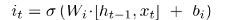

## **RECURRENT NEURAL NETWORKS (RNN)**

Recurrent neural networks are useful to make predictions for data that is sequential, where knowing what has happened before will help us predict what will be next:

_credit: Chrish Olah_

When we peak inside the network this is what happens:

_credit: Chrish Olah_

The number of iterations will depend on the sequence length we are looking for. If we want a 5 word sequence the network will repeat 5 times. The formulas happening inside the network are:
* _x_t_ is our input in a step _t_. The best way to feed inputs to our network is to one-hot encode them. For this we will create a dictionary with all our inputs mapping it's value to a number.
* _h_t_ is the hidden state at a step _t_. This is the memory of the network, and it is calculated using _x_t_ and _h_t-1_ (The hidden state from the previous iteration). The formula is  **`h_t = activation(W.x_t + U.h_t-1)`** where activation is **_tanh_** or **_ReLU_**, and **_U_**, **_W_** are sets of weigths. The initial hidden state _h_t0_ is usually initialized with al zeros.
* Finally our output is calculated like **`output = V.h_t`**, where _V_ is a set of weights. We could apply softmax to the result to get our probabilies between 1 and 0.
* The hidden state _h_t_ gets passed to the next step of the RNN.

Something important to remember is that the size of our weights _W_, _U_ and _V_ have to be a size that will give us an output the same size as _h_t_. For example if _h_t-1_ is a vector with dimensions *3x1* our weight vectors will need to have a size *3x3* for the result of *3x3.3x1* to be a vector size *3x1*.

## **LONG SHORT TERM MEMORY (LSTM)**

The problem with RNNs is that they can't remember older stuff very well, so it bases all of its predictions on recent events. Sometimes we need our network to remember older stuff to make more accurate predictions, this is where LSTMs come in. The LSTM adds a long term memory (also referred as cell state) that with the help of some gates (Forget gate, Learn gate, Remember gate and Use gate) will keep a long term memory to make more accurate predictions about the events happening right now.

_credit: Chrish Olah_

### **THE GATES**

The gates are a way to let information get through. The core idea is to modify the cell state (the line on the top of the image, also referred as long term memory) in a way that will remove and add certain current information so later on we can use it to make better predictions given a current input. 

All our gates will be each a small neural network, in charge of their own specifc task.

**Forget gate**

The first step is to decide what information we don't need from our long term memory (cell state). The forget gate is in charge of telling the cell state what information we don't need anymore. We get this from doing a element-wise multiplication (Eg: [1, 0, 3] x [2, 3, 4] = [2, 0, 12]) of our cell state and the forget factor _f_t_.

_credit: Chrish Olah_

To get our forget factor the function is going to be a bit different than when we calculated the hidden state in a RNN. **`f_t=sigmoid(W_f.[h_t-1, x_t] + b_f)`**. This will give us a result between 1 and 0. When we multiply the forget factor element wise against the cell state, values near 1 will let everything through and values near 0 will let nothing through.

Forget gate: **C'_t = C_t-1  f_t**

Our Cell state has now been updated (C'_t) to forget some information.

EXTRA NOTES: The concatenation of `[h_t-1, x_t]` will give us a vector double the length, this is why our matrix _W_f_ will have to be of a specific size that will output a vector size same as _h_t-1_.  Example: if the sizes of h_t-1_ and _x_t_ are 1x4, the matrix of weigths _W_f_ will need to have a size 4x4 so that (1x4).(4x4) = (1x4).

**Learn gate**

This gate decides what new information we will need to add to the cell state.

_credit: Chrish Olah_

This has two parts. First we need to get our new information candidates. This will be the information that might or migth not get chosen to be remembered by the cell state. We can get this with **`N_t = tanh(W_i.[h_t-1, x_t] + b_i)`**, which will give us a new vector with values from 1 to -1. 

Then we need to calculate our ignore factor. This will create a new vector that decides which new information from the candidates gets learned and which doesn't. For this to work we need a vector with values between 0 and 1 that we will later multipy element-wise with the candidates _N_t_. We get the ignore factor like this **`i_t = sigmoid(W_c.[h_t-1, x_t] + b_c)`**.

The result of **_N_t_  _i_t_** is the information that we want our long term memory to remember. We can call the result of this multiplication **_L_t_** so:

Learn gate: **_L_t = N_t  i_t_**

Now we have the information that we want to add to our cell state.

**Remember gate**

The remember gate simply adds the new information we want to remember (_L_t_) to our cell state. For this we only need to add the learned information to the current cell state.

Updated Cell state: **`C_t = L_t + C'_t`**

Our Cell state has now been updated to remember some new information.

**Output gate**

This one uses the updated cell state (or long term memory) and the hidden state (or short term memory) to come up with a new short term memory.

_credit: Chrish Olah_

Our short term memory is calculated the same as before **`o_t = sigmoid(W_o.[h_t-1, x_t] + b_o)`**. The short term memory will decide how much of the cell state we want to output, where a value of 1 will let that particular information through and 0 will let nothing through. As before we do an element wise multiplication agains the _tanh_ of the cell state _C_t_ to get our output and hidden state:

Output gate:  **_h_t = o_t  tanh(C_t)_**

### **TL;DR**

To summarize everything:

A simple **RNN** uses one equation to calculate the its hidden state:  where the function f is either a _tanh_ or _ReLU_.

A **LSTM** uses several equations to calculate the hidden state, where "" means element wise multiplication:

1) _LTM_t = LTM_t-1  forget + learn_
2) _STM_t = sigmoid(W_o.[h_t-1, x_t] + b_o)_
3) _h_t = STM_t  tanh(LTM_t)_

Variables:
* **Forget**: 
* candidates_to_remember: 
* ignore: 
* **Learn**: learn = 

## RESOURCES
* Chris Olah's tutorial: http://bit.ly/2seO9VI
* Denny Britz's tutorial: http://www.wildml.com/2015/09/recurrent-neural-networks-tutorial-part-1-introduction-to-rnns/
* Edwin Chen's tutorial: http://blog.echen.me/2017/05/30/exploring-lstms/
