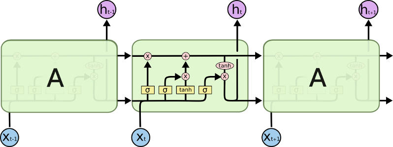
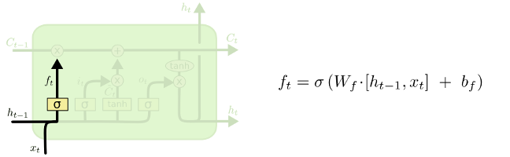
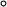

# **RECURRENT NEURAL NETWORKS (RNN)**

Recurrent neural networks are useful to make predictions for data that is sequential, where knowing what has happened before will help us predict what will be next:

_credit: Chrish Olah_

When we peak inside the network this is what happens:

_credit: Chrish Olah_

The number of iterations will depend on the sequence length we are looking for. If we want a 5 word sequence the network will repeat 5 times. The formulas happening inside the network are:
* **_x_t_** is our input in a step _t_. The best way to feed inputs to our network is to one-hot encode them. For this we will create a dictionary with all our inputs mapping it's value to a number.
* **_h_t_** is the hidden state at a step _t_. This is the memory of the network, and it is calculated using _x_t_ and _h_t-1_ (The hidden state from the previous iteration). The formula is  **`h_t = activation(W.x_t + U.h_t-1)`** where activation is **_tanh_** or **_ReLU_**, and **_U_**, **_W_** are sets of weigths. The initial hidden state _h_t0_ is usually initialized with al zeros.
* Finally our output is calculated like **`output = V.h_t`**, where _V_ is a set of weights. We could apply softmax to the result to get our probabilies between 1 and 0.
* The hidden state **_h_t_** gets passed to the next step of the RNN.

Recap:
* Caclulate hidden state: **`h_t = activation(W.x_t + U.h_t-1)`**
* Calculate output: **`output = V.h_t`**

Something important to remember is that the size of our weights _W_, _U_ and _V_ have to be a size that will give us an output the same size as _h_t-1_. For example if _h_t-1_ is a vector with dimensions *3x1* our weight vectors will need to have a size *3x3* for the result of *3x3.3x1* to be a vector size *3x1*.

However there are many implementations of the RNN's, where the formulas might change. In some cases we will see that hidden state is calculated like this instead: **`h_t = tanh(W.[x_t + h_t-1] + b)`**. Where _x_t_ and _h_t_ get concatenated and multiplied by the weights _W_. The output of the matrix multiplication will be a vector with the same size as _h_t-1_.

# **LONG SHORT TERM MEMORY (LSTM)**

The problem with RNNs is that they can't remember older stuff very well, so it bases all of its predictions on recent events. Sometimes we need our network to remember remember back a bit to make more accurate predictions, this is where LSTMs come in. The LSTM adds a long term memory (also referred as cell state) that with the help of some gates (Forget gate, Learn gate, Remember gate and Use gate) will keep a long term memory to make sure that we remember information that happened a while ago.

_credit: Chrish Olah_

## **THE GATES**

The gates are a way to let information get through. The core idea is to modify the cell state (the line on the top of the image, also referred as long term memory) in a way that will remove and add certain current information so later on we can use it to make better predictions.

All our gates will be each a small neural network, in charge of their own specifc task.

**FORGET GATE**

The first step is to decide what information we don't need from our long term memory (cell state). The forget gate is in charge of telling the cell state what information we don't need anymore. We get this from doing a element-wise multiplication (Eg: [1, 0, 3] x [2, 3, 4] = [2, 0, 12]) of our cell state and the forget factor _f_t_.

_credit: Chrish Olah_

We can get our forget factor like this: **`f_t=sigmoid(W_f.[h_t-1, x_t] + b_f)`**. This will give us a vector with values between 1 and 0. **We multiply the forget factor element wise against the cell state (C_t-1)**. The forget factor will be a vector with values between 0 and 1 (because of sigmoid) which means that when we do the element-wise multiplication values near 1 will let everything through and values near 0 will let nothing through. 

* Forget gate: **C'_t = C_t-1  f_t**

Our Cell state has now been updated (C'_t) to forget some information.

EXTRA NOTES: The concatenation of `[h_t-1, x_t]` will give us a vector double the length, this is why our matrix _W_f_ will have to be of a specific size that will output a vector size same as _h_t-1_.  Example: if the sizes of h_t-1_ and _x_t_ are 1x4, the matrix of weigths _W_f_ will need to have a size 4x4 so that (1x4).(4x4) = (1x4).

**LEARN GATE**

This gate decides what new information we will need to add to the cell state.

_credit: Chrish Olah_

This has two parts. First we need to get our new information candidates. This will be the information that might or migth not get chosen to be remembered by the cell state. We can get this with **`N_t = tanh(W_c.[h_t-1, x_t] + b_c)`**, which will give us a new vector with values from 1 to -1. 

Then we need to calculate our ignore factor. This will create a new vector that decides which new information from the candidates gets learned and which doesn't. For this to work we need a vector with values between 0 and 1 that we will later multipy element-wise with the candidates _N_t_. We get the ignore factor like this **`i_t = sigmoid(W_i.[h_t-1, x_t] + b_i)`**.

The result of **_N_t_  _i_t_** is the information that we want our long term memory to remember. We can call the result of this multiplication **_L_t_** so:

* Learn gate: **_L_t = N_t  i_t_**

Now we have the information that we want to add to our cell state.

**REMEMBER GATE**

The remember gate simply **adds the new information we want to remember (_L_t_) to our cell state**. For this we only need to add the learned information to the current cell state.

* Final_cell state: **`C_t = L_t + C'_t`**

Our Cell state has now been updated to remember some new information.

**OUTPUT GATE**

This one uses the updated cell state (or long term memory) and the hidden state (or short term memory) to come up with a new short term memory (output).

_credit: Chrish Olah_

Our short term memory is calculated the same as before **`o_t = sigmoid(W_o.[h_t-1, x_t] + b_o)`**. The short term memory will decide how much of the cell state we want to output, where a value of 1 will let that particular information through and 0 will let nothing through. As before **we do an element wise multiplication against the _tanh_ of the cell state _C_t_ to get our output** and hidden state:

* Output gate:  **_h_t = o_t  tanh(C_t)_**

### **TL;DR**

To summarize everything:

A simple **RNN** uses one equation to calculate the its hidden state:  where the function f is either a _tanh_ or _ReLU_.

A **LSTM** uses several equations to calculate the hidden state, where "" means element wise multiplication:

1) _LTM_t = LTM_t-1  forget + learn_
2) _STM_t = sigmoid(W_o.[h_t-1, x_t] + b_o)_
3) _h_t = STM_t  tanh(LTM_t)_

Variables:
* **forget**: 
* candidates_to_remember: 
* ignore: 
* **learn**: learn = 

# **IMPLEMENTING RNNs AND LSTMs**

From here one we will work out how to implement recurrent neural networks in code, where I'll be using Pytorch. But before we start let's list some things our model will need:

Prepare the data:
* **One hot encoding**: one hot encoding means converting our data to ones and ceros (Eg.[0,1,0,0,0]), because that's what the network will understand. To do this we get all of our vocabulary and convert it to a vector with size the same as the length of our vocabulary, filled all with ceros and a one. For example if we are feeding single characters to our network, our vocabulary will be **each** and every single **unique** **character** we are using, **and we convert each to a vector with ceros and a one**. Imagine our vocabulary was the word "hello!" and we are feeding our network one character at a time: our vocabulary would be 'h', 'e', 'l', 'o', '!', when we one hot encode it will be a vector length 5. So our input vector will look something like this `(batch_size=1, seq_length=1, input_size=5)`

* **Batch size**: We don't want to just feed our network one sequence at a time, we want to feed it multiple sequences at once, and we can do this with a batch size. What the batch size does is instead of caclulating the error for one char at a time in the sequence, it will caclulate the average error of the multiple chars because we are giving it multiple sequences at once (batch), which will be more efficient and therefore train faster. In the "hello!" example from before instead of feeding the network one sequence ("h", "e", "l", "l", "o", "!") we can feed it two sequences at once, so we divide our sequence into two. Therefore **our batch size will be the number of sequences we want at a time**, in this case 2 (["h","e","l"], ["l", "o","!"]). For those two sequences the error will be calculated on the step_1 for [h,l], on step_2 for [e,o], and step_3 for [l,!]. Our input vector will look like this `(batch_size=2, seq_length=1, input_size=5)`.

* **Sequence length**: The length of the sequences we feed to the network. Following the example from before where we had a batch size of 2 (2 sequences passed at one time), we can tell the network the number of steps we want for each sequence, for example a sequence length of two would make the first batch look like this: [["h", "e"], ["l","o"]]. As we can see the sequence length determines the number of steps per sequence. The results of the hidden state at the end of the batch will be passed on to the next batch as initial state. Our input vector will look like this `(batch_size=2, seq_length=2, input_size=5)`

Parameters:
* `input_size`: the size of the input vector that we feed our network each time. Our input will probably be a one hot vector, so **the size of the input will be the length** of this vector, or what is the same, the size of our vocabulary. Example: input size of [0,1,0,0,0] is 5. 
* `hidden_size`: hidden size is the **size of the output** we want our network to have. Like a normal neural network where we have an input layer and an output layer, the hidden size is the number of classes in our oputput layer.
* `num_layers`:  number of recurrent layers. E.g., setting `num_layers=2` would mean stacking two RNNs together with the second RNN taking in outputs of the first RNN and computing the final results.
* `nonlinearity`: the type of activation function you want to use. The default is tanh, but ReLU can be used instead.
* `batch_first`: this simply asks if your vector (1,1,4) will start with the batch size as the first dimension.  If `True` the input and output tensors are provided like (batch_size, seq_length, hidden_size)

## RESOURCES
* Chris Olah's tutorial: http://bit.ly/2seO9VI
* Denny Britz's tutorial: http://www.wildml.com/2015/09/recurrent-neural-networks-tutorial-part-1-introduction-to-rnns/
* Edwin Chen's tutorial: http://blog.echen.me/2017/05/30/exploring-lstms/
* Sung Kims' youtube channel: https://www.youtube.com/watch?time_continue=794&v=ogZi5oIo4fI
* Pytorch docs: https://pytorch.org/docs/
